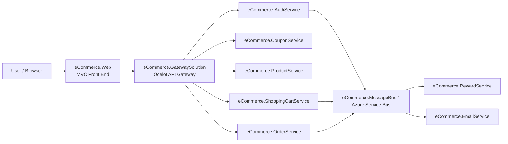
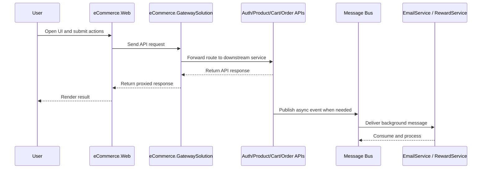
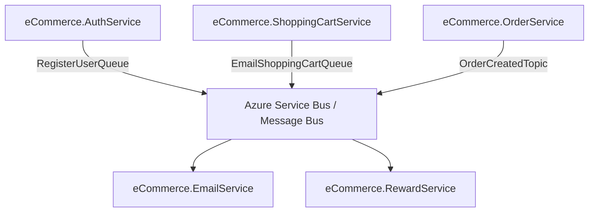

# eCommerce Microservices

This repository is an `ASP.NET Core / .NET 8` microservices solution modeled after the `Mango` reference project and adapted under the `eCommerce` name.

It currently contains:

- A web front end: `eCommerce.Web`
- An API gateway: `eCommerce.GatewaySolution`
- Backend services under `Services/`
- A shared message bus library: `eCommerce.MessageBus`

## Architecture Diagram

## Request Flow Diagram

## Solution Structure

### Front end

- `eCommerce.Web`
  Purpose:
  MVC front end for product browsing, authentication, cart flow, coupon management, order screens, and product management pages.

### Gateway

- `eCommerce.GatewaySolution`
  Purpose:
  Ocelot-based API gateway that validates JWT bearer tokens and forwards upstream routes to downstream microservices.

### Services

- `Services/eCommerce.AuthService`
  Purpose:
  User registration, login, role assignment, JWT issuance.

- `Services/eCommerce.CouponService`
  Purpose:
  Coupon CRUD and coupon lookup APIs.

- `Services/eCommerce.ProductService`
  Purpose:
  Product CRUD APIs, including image upload handling.

- `Services/eCommerce.ShoppingCartService`
  Purpose:
  Shopping cart APIs, coupon application, and cart email request publishing.

- `Services/eCommerce.OrderService`
  Purpose:
  Intended to manage order creation and order lifecycle.
  Current status:
  The project exists and builds, but its API/controller layer is not yet aligned with the Mango reference flow.

- `Services/eCommerce.RewardService`
  Purpose:
  Background consumer for order-created events and reward updates.

- `Services/eCommerce.EmailService`
  Purpose:
  Background consumer for registration, cart email, and order-created messages.

- `Services/eCommerce.MessageBus`
  Purpose:
  Shared Azure Service Bus publishing support used by multiple services.

## What The Gateway Does

`eCommerce.GatewaySolution` is a thin API gateway based on `Ocelot`.

It is responsible for:

1. Reading route definitions from `ocelot.json` or `ocelot.Production.json`
2. Validating JWT bearer tokens using the same JWT settings as the auth service
3. Forwarding public and protected API requests to downstream services

Currently configured gateway routes cover:

- Product API
- Coupon API
- Shopping cart API
- Order API

Note:
`Auth`, `Reward`, and `Email` are not currently exposed through the gateway because the Mango gateway pattern did not proxy those routes either.

## Current URLs

These values are based on the current `launchSettings.json` files and app configuration.

### Front end

- `eCommerce.Web`: `https://localhost:7126`

### Gateway

- `eCommerce.GatewaySolution`: `https://localhost:7777`

### Services

- `eCommerce.ProductService`: `https://localhost:7000`
- `eCommerce.CouponService`: `https://localhost:7001`
- `eCommerce.AuthService`: `https://localhost:7002`
- `eCommerce.ShoppingCartService`: `https://localhost:7003`
- `eCommerce.OrderService`: `https://localhost:7274`
- `eCommerce.RewardService`: `https://localhost:7156`
- `eCommerce.EmailService`: `https://localhost:7299`

## Web App Configuration

`eCommerce.Web/appsettings.json` currently points to these service base URLs:

- Coupon: `https://localhost:7001`
- Product: `https://localhost:7000`
- Auth: `https://localhost:7002`
- Shopping Cart: `https://localhost:7003`
- Order: `https://localhost:7274`

## Messaging / Background Processing

The solution uses Azure Service Bus style messaging.

Important flows currently implemented:

- `AuthService` publishes `RegisterUserQueue`
- `ShoppingCartService` publishes `EmailShoppingCartQueue`
- `OrderService` is intended to publish `OrderCreatedTopic`
- `EmailService` consumes registration, cart email, and order-created messages
- `RewardService` consumes order-created messages

## Messaging Diagram

## Current Implementation Status

### Implemented and building

- `eCommerce.Web` service layer, controllers, and views
- `eCommerce.EmailService`
- `eCommerce.GatewaySolution`
- Core service projects included in the solution

### Partially implemented / needs follow-up

- `eCommerce.OrderService`
  Current controller discovery shows only `WeatherForecastController` under `Controllers/`, so the full Mango-style order API surface is not yet present.

- `eCommerce.RewardService`
  Builds successfully, but it behaves mainly as a background/message consumer rather than a user-facing API.

- `eCommerce.EmailService`
  Builds successfully and is designed as a background/message consumer; it does not expose user-facing controllers.

## Authentication Notes

JWT settings are currently stored under:

- `Services/eCommerce.AuthService/appsettings.json`
- `eCommerce.GatewaySolution/appsettings.json`

Path used:

- `ApiSettings:JwtOptions`

Current issuer/audience names still use Mango-style values:

- Issuer: `mango-auth-api`
- Audience: `mango-client`

That is functional as long as both auth service and gateway use the same values, but you may want to rename them later to `eCommerce`-specific values for clarity.

## Build Status

At the time of this update:

- `dotnet build D:\Shubhash\Project\Microservices\eCommerce\eCommerce.Web\eCommerce.Web.csproj` succeeds
- `dotnet build D:\Shubhash\Project\Microservices\eCommerce\eCommerce.GatewaySolution\eCommerce.GatewaySolution.csproj` succeeds
- `dotnet build D:\Shubhash\Project\Microservices\eCommerce\eCommerce.sln` succeeds

There are still existing warnings in the solution, mainly:

- Nullable reference warnings
- Unused variable warnings
- `AutoMapper 12.0.1` vulnerability warnings in some service projects

## Recommended Next Steps

1. Complete the `eCommerce.OrderService` API/controller implementation to match the web and gateway expectations.
2. Clean up nullable warnings across services and web.
3. Replace Mango-branded JWT issuer/audience values with `eCommerce` names if desired.
4. Review gateway production routing before deployment.
5. Decide whether `Auth` APIs should also be proxied through the gateway.
